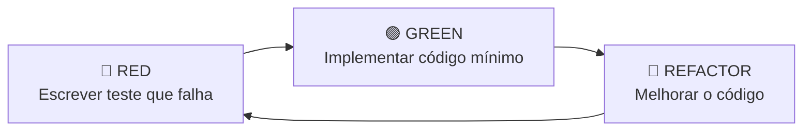

# 🧪 Guia de Test Driven Development (TDD)

Este documento explica como o **TDD** foi implementado na WorkOut API e como continuar desenvolvendo seguindo essa metodologia.

## 🎯 O que é TDD?

**Test Driven Development** é uma prática de desenvolvimento onde os **testes são escritos antes do código de produção**, seguindo o ciclo:

### 🔄 Ciclo Red-Green-Refactor



1. **🔴 RED**: Escreva um teste que falha
2. **🟢 GREEN**: Implemente apenas o código necessário para o teste passar
3. **🔵 REFACTOR**: Melhore o código mantendo os testes passando

## 🏗️ Estrutura de Testes no Projeto

### 📁 Organização dos Testes

```
tests/
├── 📄 conftest.py          # Configurações globais pytest
├── 📄 factories.py         # Factory Boy (geração de dados)
├── 📁 unit/                # Testes unitários
│   ├── 📄 test_schemas.py      # Validação Pydantic
│   └── 📄 test_controllers.py  # Lógica de negócio
└── 📁 integration/         # Testes de integração
    ├── 📄 test_atleta_router.py
    ├── 📄 test_categoria_router.py
    └── 📄 test_centro_treinamento_router.py
```

### 🧪 Tipos de Teste

#### 1. **Testes Unitários** (`tests/unit/`)
- Testam **componentes isolados**
- **Rápidos** e **determinísticos**
- Usam **mocks** para dependências externas

```python
def test_atleta_in_valid_data():
    """Teste: AtletaIn deve aceitar dados válidos"""
    valid_data = {
        "nome": "João Silva",
        "cpf": "12345678901",
        # ...
    }
    
    atleta = AtletaIn(**valid_data)
    
    assert atleta.nome == "João Silva"
    assert atleta.cpf == "12345678901"
```

#### 2. **Testes de Integração** (`tests/integration/`)
- Testam **fluxos completos**
- Usam **banco de dados real** (SQLite em memória)
- Testam **endpoints HTTP** completos

```python
async def test_create_atleta_success(client: AsyncClient, setup_data):
    """Teste: POST /atletas deve criar atleta com sucesso"""
    response = await client.post("/atletas/", json=atleta_data)
    
    assert response.status_code == 201
    assert response.json()["nome"] == "João Silva"
```

## 🛠️ Ferramentas Utilizadas

### 🔧 Pytest
- **Framework de testes** principal
- Suporte a **async/await**
- **Fixtures** para setup/teardown

### 🏭 Factory Boy
- **Geração de dados** de teste
- **Dados consistentes** e **variados**
- **Relacionamentos** entre entidades

```python
class AtletaFactory(factory.Factory):
    class Meta:
        model = AtletaModel
    
    nome = factory.Faker('name')
    cpf = factory.Faker('numerify', text='###########')
    idade = factory.Faker('random_int', min=18, max=45)
```

### 🌐 HTTPX AsyncClient
- **Cliente HTTP assíncrono** para testes
- **Integração** com FastAPI
- **Testes de endpoints** completos

### 📊 Pytest-Cov
- **Cobertura de código**
- **Relatórios HTML**
- **Métricas** de qualidade

## 🎯 Como Desenvolver com TDD

### 📝 Exemplo Prático: Adicionar Nova Funcionalidade

Vamos implementar uma funcionalidade para **buscar atletas por categoria**.

#### 1. **🔴 RED - Escrever o Teste Primeiro**

```python
# tests/integration/test_atleta_router.py

async def test_get_atletas_filter_by_categoria(client: AsyncClient, setup_data):
    """Teste: GET /atletas?categoria=Scale deve filtrar por categoria"""
    # Arrange - Criar atletas de categorias diferentes
    atleta_scale = {
        "nome": "João Scale",
        "categoria_id": setup_data["categoria_scale_id"],
        # ... outros campos
    }
    atleta_rx = {
        "nome": "Maria RX", 
        "categoria_id": setup_data["categoria_rx_id"],
        # ... outros campos
    }
    
    await client.post("/atletas/", json=atleta_scale)
    await client.post("/atletas/", json=atleta_rx)
    
    # Act - Buscar apenas atletas Scale
    response = await client.get("/atletas/?categoria=Scale")
    
    # Assert
    assert response.status_code == 200
    data = response.json()
    assert len(data["items"]) == 1
    assert data["items"][0]["nome"] == "João Scale"
```

**Executar**: `pytest tests/integration/test_atleta_router.py::TestAtletaRouter::test_get_atletas_filter_by_categoria -v`

**Resultado**: ❌ **FALHA** (endpoint não existe ainda)

#### 2. **🟢 GREEN - Implementar Código Mínimo**

```python
# workout_api/routers/atleta_router.py

@router.get('/', response_model=Page[AtletaListOut])
async def query(
    db_session: AsyncSession = Depends(get_session),
    nome: str = Query(None, description="Filtrar por nome"),
    cpf: str = Query(None, description="Filtrar por CPF"),
    categoria: str = Query(None, description="Filtrar por categoria")  # NOVO
):
    return await AtletaController.get_all(
        db_session=db_session, 
        nome=nome, 
        cpf=cpf,
        categoria=categoria  # NOVO
    )
```

```python
# workout_api/controllers/atleta_controller.py

@staticmethod
async def get_all(
    db_session: AsyncSession,
    nome: str = None,
    cpf: str = None,
    categoria: str = None  # NOVO
) -> Page[AtletaListOut]:
    statement = select(AtletaModel)
    
    if nome:
        statement = statement.filter(AtletaModel.nome.ilike(f'%{nome}%'))
    if cpf:
        statement = statement.filter(AtletaModel.cpf == cpf)
    if categoria:  # NOVO
        statement = statement.join(CategoriaModel).filter(
            CategoriaModel.nome.ilike(f'%{categoria}%')
        )
    
    # ... resto do código
```

**Executar**: `pytest tests/integration/test_atleta_router.py::TestAtletaRouter::test_get_atletas_filter_by_categoria -v`

**Resultado**: ✅ **SUCESSO**

#### 3. **🔵 REFACTOR - Melhorar o Código**

```python
# workout_api/controllers/atleta_controller.py

@staticmethod
async def get_all(
    db_session: AsyncSession,
    filters: AtletaFilters  # Usar um schema para filtros
) -> Page[AtletaListOut]:
    statement = select(AtletaModel)
    
    # Aplicar filtros de forma mais organizada
    statement = filters.apply_to_query(statement)
    
    # ... resto do código
```

**Executar**: `make test` para garantir que todos os testes continuam passando.

### 🔄 Ciclo Completo

1. **Teste falha** → Implementa funcionalidade
2. **Teste passa** → Refatora código
3. **Todos os testes passam** → Próxima funcionalidade

## 📊 Executando Testes

### 🚀 Comandos Básicos

```bash
# Todos os testes
make test

# Com cobertura
make test-cov

# Apenas unitários
make test-unit

# Apenas integração
make test-integration

# Teste específico
pytest tests/unit/test_schemas.py::TestAtletaSchema::test_atleta_in_valid_data -v

# Watch mode (re-executa quando código muda)
pytest --looponfail tests/
```

### 📈 Interpretando Coverage

```bash
make test-cov
```

**Saída esperada**:
```
Name                                      Stmts   Miss  Cover   Missing
-----------------------------------------------------------------------
workout_api/__init__.py                       0      0   100%
workout_api/controllers/atleta_controller.py  45      2    96%   78-79
workout_api/models/atleta_model.py            15      0   100%
workout_api/routers/atleta_router.py          32      1    97%   45
workout_api/schemas/atleta_schema.py          28      0   100%
-----------------------------------------------------------------------
TOTAL                                        120      3    98%
```

**Meta**: Manter **cobertura > 90%**

## 🎯 Boas Práticas TDD

### ✅ DO's

1. **Teste Primeiro**: Sempre escreva o teste antes do código
2. **Pequenos Passos**: Implemente apenas o necessário para passar
3. **Nomes Descritivos**: Testes devem explicar o comportamento esperado
4. **AAA Pattern**: **Arrange** → **Act** → **Assert**
5. **Isolamento**: Cada teste deve ser independente
6. **Fast**: Testes unitários devem ser rápidos (< 1s)

### ❌ DON'Ts

1. **Não pule testes**: Nunca implemente sem teste
2. **Não teste implementação**: Teste comportamento, não código
3. **Não teste frameworks**: Teste sua lógica, não FastAPI/SQLAlchemy
4. **Não testes dependentes**: Evite ordem de execução
5. **Não over-engineer**: Implemente apenas o necessário

### 🎪 Arrange-Act-Assert (AAA)

```python
async def test_create_atleta_success(client: AsyncClient, setup_data):
    # 📋 ARRANGE - Preparar dados
    atleta_data = {
        "nome": "João Silva",
        "cpf": "12345678901",
        # ...
    }
    
    # 🎬 ACT - Executar ação
    response = await client.post("/atletas/", json=atleta_data)
    
    # ✅ ASSERT - Verificar resultado
    assert response.status_code == 201
    assert response.json()["nome"] == "João Silva"
```

## 🔧 Configuração de Fixtures

### 🛠️ Fixtures Globais (`conftest.py`)

```python
@pytest.fixture
async def client(db_session):
    """Cliente HTTP para testes de integração"""
    def get_test_session():
        return db_session
    
    app.dependency_overrides[get_session] = get_test_session
    
    async with AsyncClient(app=app, base_url="http://test") as ac:
        yield ac
    
    app.dependency_overrides.clear()
```

### 🏭 Fixtures de Dados (`factories.py`)

```python
@pytest.fixture
async def atleta_data():
    """Dados válidos para criar atleta"""
    return {
        "nome": "João Silva",
        "cpf": "12345678901",
        "idade": 25,
        # ...
    }
```

## 📚 Recursos Adicionais

### 📖 Leitura Recomendada

- [Test Driven Development by Kent Beck](https://www.amazon.com/Test-Driven-Development-Kent-Beck/dp/0321146530)
- [FastAPI Testing Guide](https://fastapi.tiangolo.com/tutorial/testing/)
- [Pytest Documentation](https://docs.pytest.org/)

### 🎥 Vídeos

- [TDD with Python and FastAPI](https://www.youtube.com/results?search_query=tdd+python+fastapi)
- [Clean Code and Testing](https://www.youtube.com/results?search_query=clean+code+testing)

### 🔗 Links Úteis

- [Factory Boy Documentation](https://factoryboy.readthedocs.io/)
- [HTTPX Documentation](https://www.python-httpx.org/)
- [SQLAlchemy Testing](https://docs.sqlalchemy.org/en/14/orm/session_transaction.html#joining-a-session-into-an-external-transaction-such-as-for-test-suites)

---

**🎯 Lembre-se: TDD não é sobre ter mais testes, é sobre ter confiança no seu código!** 